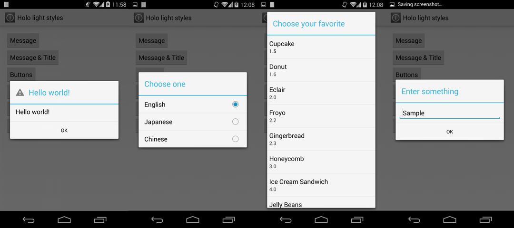
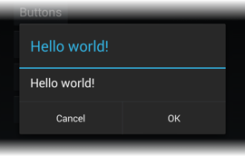
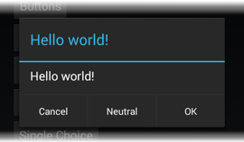
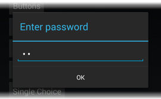

SimpleAlertDialog for Android
===

[](https://travis-ci.org/ksoichiro/SimpleAlertDialog-for-Android)
[](https://coveralls.io/r/ksoichiro/SimpleAlertDialog-for-Android?branch=master)

SimpleAlertDialogは、Androidアプリケーションで`DialogFragment`を`AlertDialog`のように簡単に扱えるようにするためのライブラリです。





## 特徴

* APIレベル4 (Android 1.6 Donut)からレベル19 (Android 4.4 KitKat) そして L で利用可能です。
* Holoスタイルのダイアログを全てのバージョンで使えます。
* `AlertDialog.Builder`のようにシンプルなインタフェースです。
* 基本的なイベントをハンドリングするコールバックが用意してあります。
* ダイアログのライフサイクルは、親となるActivityやFragmentと同期しているため、`IllegalStateException`に悩まされることはありません。
* APIレベル11以上での通常の`Activity`と、android-support-v4ライブラリの`FragmentActivity`の両方をサポートしています。

## インストール

### Gradle

```groovy
dependencies {
    compile 'com.github.ksoichiro:simplealertdialog:1.1.2@aar'
}
```

### Eclipse ADT (ライブラリプロジェクトとしてインポート)

simplealertdialogフォルダがライブラリ本体です。
EclipseやAndroid StudioなどのIDEでAndroid Library Projectとして取り込んでください。

## 使用方法

### メッセージとボタン


メッセージとOKボタンだけのダイアログを表示するには、以下のようにします。

```java
new SimpleAlertDialogFragment.Builder()
        .setMessage("Hello world!")
        .setPositiveButton(android.R.string.ok)
        .create().show(getFragmentManager(), "dialog");
```

### ボタンのタップイベントのハンドリング



ボタンがタップされたイベントをハンドリングする場合は、以下のようにダイアログを表示します。

```java
new SimpleAlertDialogFragment.Builder()
        .setMessage("Hello world!")
        .setPositiveButton(android.R.string.ok)
        .setNegativeButton(android.R.string.cancel)
        .setRequestCode(1)
        .create().show(getFragmentManager(), "dialog");
```

Activityは、以下のように`SimpleAlertDialog.OnClickListener`インタフェースを実装させます。

```java
public class NormalActivity extends Activity
        implements SimpleAlertDialog.OnClickListener
```

そして、ハンドラーを定義します。

```java
@Override
public void onDialogPositiveButtonClicked(SimpleAlertDialog dialog,
        int requestCode, View view) {
    if (requestCode == 1) {
        Toast.makeText(this, "OK button clicked", Toast.LENGTH_SHORT).show();
    }
}

@Override
public void onDialogNegativeButtonClicked(SimpleAlertDialog dialog,
        int requestCode, View view) {
    if (requestCode == 1) {
        Toast.makeText(this, "Cancel button clicked", Toast.LENGTH_SHORT).show();
    }
}
```

上記のリクエストコード(requestCode)を設定するのを忘れないでください。  
ひとつの`Actvity`や`Fragment`の中で複数の種類のダイアログを表示させる場合、同じコールバックメソッドを共用することになります。そこで、「リクエストコード」を設定してからダイアログを表示させ、コールバックでそのリクエストコードを渡すこと、どのダイアログによるイベントなのかを区別します。

### ニュートラルボタン



`AlertDialog.Builder`と同じように、OK、キャンセルの他にニュートラルボタンを設定する場合は以下のようにします。

```java
new SimpleAlertDialogFragment.Builder()
        .setMessage("Hello world!")
        .setPositiveButton(android.R.string.ok)
        .setNeutralButton(R.string.neutral)
        .setNegativeButton(android.R.string.cancel)
        .setRequestCode(1)
        .create().show(getFragmentManager(), "dialog");
```

ニュートラルボタンのイベントをハンドリングするには、OK、キャンセルボタンの`SimpleAlertDialog.OnClickListener`とは別に、以下のように`SimpleAlertDialog.OnNeutralButtonClickListener`インタフェースを実装させます。

```java
public class NormalActivity extends Activity
        implements SimpleAlertDialog.OnNeutralButtonClickListener
```

そして、ハンドラーを定義します。

```java
@Override
public void onDialogNeutralButtonClicked(SimpleAlertDialog dialog, int requestCode, View view) {
    if (requestCode == 1) {
        Toast.makeText(this, "Neutral button clicked", Toast.LENGTH_SHORT).show();
    }
}
```

### リスト


リストのダイアログは、以下のように表示します。

```java
new SimpleAlertDialogFragment.Builder()
        .setTitle("Choose one")
        .setItems(R.array.single_choice)
        .setRequestCode(REQUEST_CODE_ITEMS)
        .create().show(getFragmentManager(), "dialog");
```

インタフェースを実装します。

```java
implements SimpleAlertDialog.OnItemClickListener
```

コールバックを実装します。

```java
@Override
public void onOnItemClick(final SimpleAlertDialog dialog, int requestCode,
        int which) {
    if (requestCode == REQUEST_CODE_ITEMS) {
        // Do something
    }
}
```

### アイコンつきリスト


アイコンつきリストのダイアログは、以下のように表示します。

```java
new SimpleAlertDialogFragment.Builder()
        .setTitle("Choose one")
        .setItems(R.array.icon_items, new int[]{
                R.drawable.ic_action_aci_document3,
                R.drawable.ic_action_aci_edit,
                R.drawable.ic_action_aci_search})
        .setRequestCode(REQUEST_CODE_ICON_ITEMS)
        .create().show(getFragmentManager(), "dialog");
```

コールバックはリストの場合と同様に`SimpleAlertDialog.OnItemClickListener`を使用します。

### 単一選択リスト(Single choice list)


単一選択リストのダイアログは、以下のように表示します。

```java
new SimpleAlertDialogFragment.Builder()
        .setTitle("Choose one")
        .setSingleChoiceCheckedItem(0) // この設定で単一選択リストが有効になります
        .setRequestCode(REQUEST_CODE_SINGLE_CHOICE_LIST)
        .create().show(getFragmentManager(), "dialog");
```

インタフェースを実装します。

```java
implements SimpleAlertDialog.SingleChoiceArrayItemProvider
```

コールバックを実装します。

```java
@Override
public CharSequence[] onCreateSingleChoiceArray(final SimpleAlertDialog dialog, int requestCode) {
    if (requestCode == REQUEST_CODE_SINGLE_CHOICE_LIST) {
        return getResources().getTextArray(R.array.single_choice);
    }
    return null;
}

@Override
public void onSingleChoiceArrayItemClick(final SimpleAlertDialog dialog, int requestCode,
        int position) {
    if (requestCode == REQUEST_CODE_SINGLE_CHOICE_LIST) {
        // Do something
    }
}
```

### カスタムアダプタ


カスタマイズした`ListAdapter`を使ったダイアログは以下のように表示します。

```java
new SimpleAlertDialogFragment.Builder()
        .setTitle("Choose your favorite")
        .setUseAdapter(true) // この設定でカスタムアダプタが有効になります
        .setRequestCode(REQUEST_CODE_ADAPTER)
        .create().show(getFragmentManager(), "dialog");
```

インタフェースを実装します。

```java
implements SimpleAlertDialog.ListProvider
```

コールバックを実装します。

```java
@Override
public ListAdapter onCreateList(SimpleAlertDialog dialog, int requestCode) {
    if (requestCode == REQUEST_CODE_ADAPTER) {
        // Create your custom adapter
        return new SweetsAdapter(this, SWEETS_LIST);
    }
    return null;
}

@Override
public void onListItemClick(SimpleAlertDialog dialog, int requestCode, int position) {
    if (requestCode == REQUEST_CODE_ADAPTER) {
        // Do something
    }
}
```

### カスタムビュー


カスタマイズしたビューを使ったダイアログは以下のように表示します。

```java
new SimpleAlertDialogFragment.Builder()
        .setTitle("Enter something")
        .setUseView(true) // この設定でカスタムビューが有効になります
        .setRequestCode(REQUEST_CODE_VIEW)
        .create().show(getFragmentManager(), "dialog");
```

インタフェースを実装します。

```java
implements SimpleAlertDialog.ViewProvider
```

コールバックを実装します。

```java
@Override
public View onCreateView(SimpleAlertDialog dialog, int requestCode) {
    if (requestCode == REQUEST_CODE_VIEW) {
        final View view = LayoutInflater.from(this).inflate(R.layout.view_editor, null);
        ((EditText) view.findViewById(R.id.text)).setText("Sample");
        return view;
    }
    return null;
}
```

### EditText



単純なEditTextのみのビューは、カスタムビューを用意しなくても以下で表示できます。

```java
new SimpleAlertDialogFragment.Builder()
        .setTitle("Enter something")
        .setEditText("Sample", InputType.TYPE_CLASS_TEXT)
        .setRequestCode(REQUEST_CODE_EDIT_TEXT)
        .create().show(getFragmentManager(), "dialog");
```

## スタイルのカスタマイズ

ダイアログの画部分のUIをカスタマイズすることができます。  
以下のように、アプリケーションのテーマに`simpleAlertDialogStyle`という要素を定義します。

```xml
<style name="CustomTheme" parent="CustomBaseTheme">
    <item name="simpleAlertDialogStyle">@style/SimpleAlertDialogStyle</item>
</style>
```

この要素で指定したスタイルの中に、以下のように詳細を定義します。

```xml
<style name="SimpleAlertDialogStyle" parent="@style/Theme.SimpleAlertDialog">
    <!-- タイトルのセパレータのスタイル -->
    <item name="sadTitleSeparatorBackground">@drawable/title_separator</item>
    <item name="sadTitleSeparatorHeight">1dp</item>
    <!-- タイトル部分のTextViewのスタイル -->
    <item name="sadTitleTextStyle">@style/SimpleAlertDialogTitleTextStyle</item>
    <!-- メッセージ部分のTextViewのスタイル -->
    <item name="sadMessageTextStyle">@style/SimpleAlertDialogMessageTextStyle</item>
    <!-- OK / キャンセル ボタン部分のTextViewのスタイル -->
    <item name="sadButtonTextStyle">@style/SimpleAlertDialogButtonTextStyle</item>
    <!-- 単一選択リスト項目のTextViewのスタイル -->
    <item name="sadListItemTextStyle">@style/SimpleAlertDialogListItemTextStyle</item>
    <!-- 単一選択リスト項目のラジオボタンのDrawable -->
    <item name="sadListChoiceIndicatorSingle">@drawable/simpleblue_btn_radio</item>
</style>
```

上記スタイルの`xxxTextStyle`は`TextAppearance`として反映されます。  
つまり、例えば以下のように、通常の`TextView`の`TextAppearance`として様々なカスタマイズができます。

```xml
<style name="SimpleAlertDialogTitleTextStyle">
    <item name="android:textColor">#FF99CC00</item>
    <item name="android:fontFamily">sans-serif-light</item>
</style>
```

Holo Lightスタイルを使用したい場合は、以下のようにスタイルの`parent`属性を`@style/Theme.SimpleAlertDialog.Light`として定義します。

```xml
<style name="SimpleAlertDialogStyle" parent="@style/Theme.SimpleAlertDialog.Light">
```

## さらに詳しい使用方法と設計について

### Fragmentと一緒に使う

SimpleAlertDialogは、呼び出し元のFragmentを`getTargetFragment()`メソッドを使って取得します。  
そのため、もしFragmentからSimpleAlertDialogのコールバックを受けたい場合は
`setTargetFragment()`をBuilderによるダイアログ構築時に呼び出してください。

```java
        new SimpleAlertDialogSupportFragment.Builder()
            // 以下によってSimpleAlertDialogはMyFragment
            // が呼び出し元だと認識することができます
            .setTargetFragment(MyFragment.this)
            :
```

### なぜコールバックやパラメータ渡しのインタフェースを実装する必要があるのでしょうか？

SimpleAlertDialogは`DialogFragment`の一種に過ぎないため、
`Fragment`や`DialogFragment`の取り扱い方に従う必要があります。  
`DialogFragment`はライフサイクルを持っており、`Activity`のライフサイクルとは異なります。

そのため、カスタムビューやコールバックなどを直接渡してしまうと、アプリのクラッシュにつながってしまいます。
ActivityやFragmentはそれぞれ別のライフサイクルを持っており再生成されるため、ActivityとFragmentの参照関係が無効(`NullPointerException`など)になってしまったり、`Builder`で渡したオブジェクトが途中で`null`になり再生成できないことがあるためです。

この問題に対処するために、`Fragment`(`DialogFragment`)にはフィールドを持たせず、引数なしコンストラクタを定義し、`Fragment`へのすべてのパラメータは`Bundle`オブジェクトで取り扱う必要があります。

これらを考慮すると、SimpleAlertDialogはコールバック先を`getActivity`または`getTargetFragment`でアクセスできるオブジェクトだと仮定し、さらに特定のインタフェースを実装していたらコールバックする、という特定のインスタンスの参照関係に頼らない方法でコールバックするのがベストではないかと考えました。

そのため、一見して非常に回りくどいインタフェースを多用する方法を採っています。

## サンプル

* ライブラリを使用したサンプルアプリケーションは、simplealertdialog-samplesフォルダに含まれています。
* Google Playからダウンロードしてお試しいただけます。

  [](https://play.google.com/store/apps/details?id=com.simplealertdialog.sample.demos)


## 開発者

* Soichiro Kashima - <soichiro.kashima@gmail.com>


## ライセンス

    Copyright 2014 Soichiro Kashima

    Licensed under the Apache License, Version 2.0 (the "License");
    you may not use this file except in compliance with the License.
    You may obtain a copy of the License at

        http://www.apache.org/licenses/LICENSE-2.0

    Unless required by applicable law or agreed to in writing, software
    distributed under the License is distributed on an "AS IS" BASIS,
    WITHOUT WARRANTIES OR CONDITIONS OF ANY KIND, either express or implied.
    See the License for the specific language governing permissions and
    limitations under the License.

一部のDrawablesはAndroid Open Source Projectで作成されたものです。

    Copyright (C) 2010 The Android Open Source Project

    Licensed under the Apache License, Version 2.0 (the "License");
    you may not use this file except in compliance with the License.
    You may obtain a copy of the License at

        http://www.apache.org/licenses/LICENSE-2.0

    Unless required by applicable law or agreed to in writing, software
    distributed under the License is distributed on an "AS IS" BASIS,
    WITHOUT WARRANTIES OR CONDITIONS OF ANY KIND, either express or implied.
    See the License for the specific language governing permissions and
    limitations under the License.

このライブラリはリリースに[chrisbanes/gradle-mvn-push](https://github.com/chrisbanes/gradle-mvn-push)を使用しています。

    Copyright 2013 Chris Banes

    Licensed under the Apache License, Version 2.0 (the "License");
    you may not use this file except in compliance with the License.
    You may obtain a copy of the License at

        http://www.apache.org/licenses/LICENSE-2.0

    Unless required by applicable law or agreed to in writing, software
    distributed under the License is distributed on an "AS IS" BASIS,
    WITHOUT WARRANTIES OR CONDITIONS OF ANY KIND, either express or implied.
    See the License for the specific language governing permissions and
    limitations under the License.
